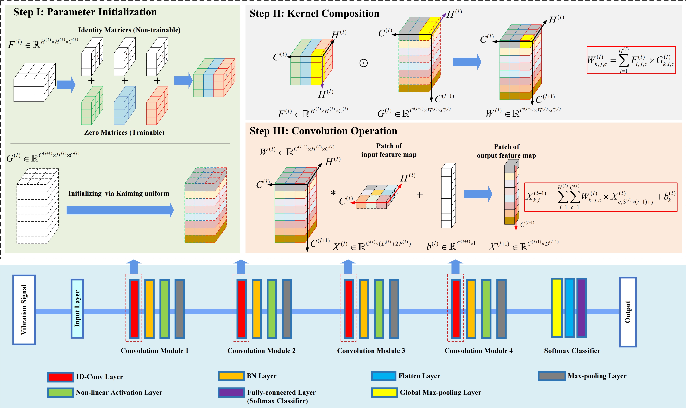
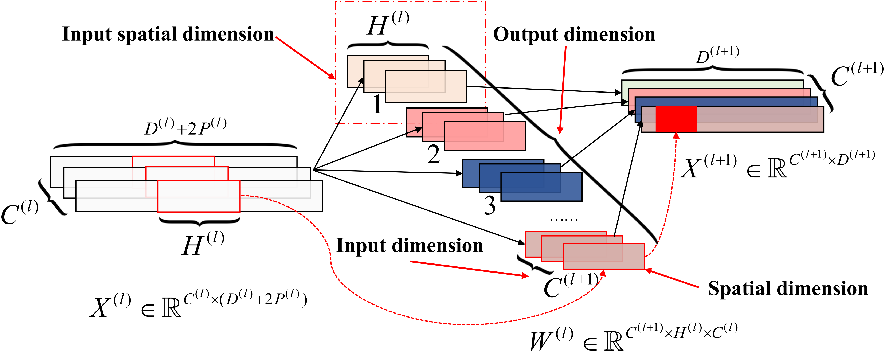
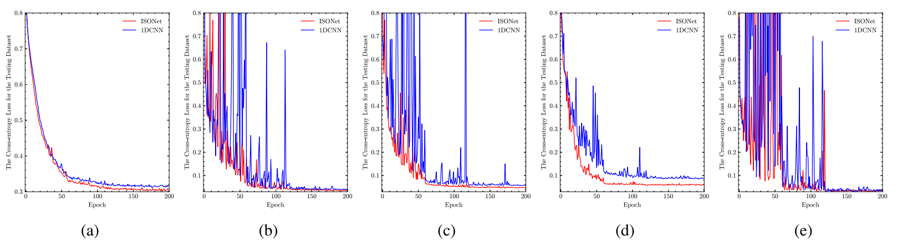
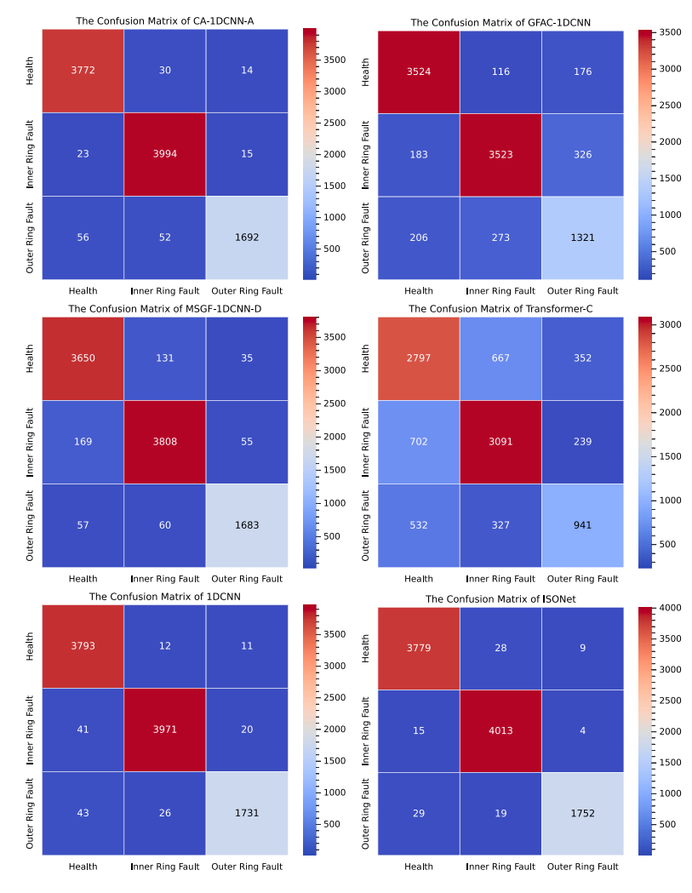

# ISONet: Reforming 1DCNN for aero-engine system inter-shaft bearing fault diagnosis via input spatial over-parameterization

## Abstract
Data-driven neural networks have risen as avant-garde approaches to fault diagnosis. However, recent studies have indicated that traditional one-dimensional convolutional neural networks (1DCNNs) exhibit inadequate performance in diagnosing faults within the aero-engine system's inter-shaft bearings. Addressing this, we introduces a novel 1DCNN variant, termed ISONet, which incorporates over-parameterization in the input spatial dimension to enhance the training landscape of 1DCNNs. Theoretically, we prove that this over-parameterization is akin to implicitly integrating a specific preconditioning scheme from a dynamic differential perspective. This preconditioning facilitates optimization movement along previously traversed directions, effectively acting as an acceleration procedure that amalgamates momentum with adaptive learning rates. Empirical validation confirms the irreplaceability of this implicit acceleration mechanism, demonstrating its capacity to further augment the convergence speed and stability of training, even when advanced gradient descent optimizers with explicit momentum and adaptive learning rates are employed. During the training phase, ISONet does not significantly increase training time, and it can be folded into a standard 1DCNN during the testing phase. The efficacy of the proposed ISONet architecture is substantiated through empirical testing utilizing real-world vibration data from an aero-engine test rig. Comparative analyses indicate that ISONet surpasses current state-of-the-art deep learning models, particularly under various limited-sample conditions. 

  
*Fig. 1: Architecture of ISONet, consisting of input layer, 1D-ISOConv modules, batch normalization, activation, pooling, flattening, and Softmax classifier.*

## Key Contributions
1. **1D-ISOConv Layer**: Introduces **input spatial over-parameterization** by decomposing convolution kernels into trainable tensors $F^{(l)}$ and $ G^{(l)} $.  
   - **Training Phase**: Accelerates convergence via implicit momentum and adaptive learning rates.  
   - **Testing Phase**: Folds into standard 1D-Conv for computational efficiency.  

2. **Theoretical Foundation**: Proves that over-parameterization acts as a preconditioning scheme, combining momentum and adaptive gradient dynamics (Eq. 24).  

3. **Superior Performance**: Achieves **99.92% accuracy** on the HIT dataset under limited-sample conditions, outperforming CNNs, Transformers, and SOTA models.

---

## Methodology Highlights

### Input Spatial Over-Parameterization
- **Kernel Composition**: $ W^{(l)} = F^{(l)} \odot G^{(l)} $, where $ F^{(l)} $ is initialized with identity matrices (frozen) and zero matrices (trainable).  
- **Optimization Dynamics**: Mimics adaptive momentum (Eq. 20) and accelerates training without increasing inference complexity.  

  
*Fig. 2: Over-parameterization in input spatial dimensions (red blocks) enhances feature learning while maintaining test-time efficiency.*

### Theoretical Foundation  
- The over-parameterization transforms the gradient update rule into a differential equation incorporating adaptive learning rates and momentum:  
$\dot{w}(t) = -2\eta\lambda w(t) - \eta\|w(t)\|_2 \left( \frac{d\mathcal{J}}{dw} + \text{Proj}_w \left( \frac{d\mathcal{J}}{dw} \right) \right)$

  This implicitly accelerates convergence by aligning updates with historical gradients and scaling learning rates adaptively.  
  
*Fig. 3: Diagram of tensor operation process of 1D-ISOConv and its underlying matrix/vector operations. The blocks filled with color represent the weights/inputs related to the computation of  $z$ .*
---

## Experimental Results
###  Dataset  
The **HIT dataset** (Hou et al., 2023) includes 2412 vibration signal samples from aero-engine test rigs, covering healthy, inner ring fault, and outer ring fault states. Data is split into 2412 training and 9648 test samples, challenging models with limited training data.  
### Key Findings
- **Robustness**: ISONet outperforms 1DCNN and SOTA models across batch sizes, kernel sizes, and channel configurations (Table 1).  
- **Optimizer Comparison**: Adan optimizer achieves fastest convergence (Fig. 6) with **98.92% test accuracy**.  
- **Activation Function**: Mish activation yields highest F1-score (Table 2).  
- **Irreplaceability Demonstration**: ISOConv introduces a unique acceleration mechanism orthogonal to explicit optimizer designs. ISONet consistently exhibits faster convergence and lower final loss values compared to 1DCNN, even when paired with optimizers that explicitly incorporate momentum (e.g., Adan, Adamax) or adaptive learning rates (e.g., AdaBelief, CAME). 
  
*Fig. 3: The loss curves of ISONet and 1DCNN with different optimizers. (a) Adadelta, (b) Adamax, (c) AdaBelief, (d) CAME, and (e) Adan.*
- **SOTA Model Comparison**:
Table 3 shows ISONet surpasses state-of-the-art models like CA-1DCNN, MSGF-1DCNN, and Transformer in weighted precision, recall, and F1-score. Notably, ISONet achieves 98.92% F1-score, significantly higher than Transformer’s 70.56%.  

| Model              | Precision (%) | Recall (%) | F1-Score (%) |  
|--------------------|---------------|------------|--------------|  
| CA-1DCNN-A         | 98.03         | 98.03      | 98.02        |  
| MSGF-1DCNN-D       | 94.75         | 94.74      | 94.74        |  
| Transformer-C      | 70.53         | 70.78      | 70.56        |  
| 1DCNN              | 98.42         | 98.41      | 98.41        |  
| **ISONet**         | **98.92**     | **98.92**  | **98.92**    |  
*Table 3: Comparison with state-of-the-art models.*  

  
*Fig. 4: ISONet shows minimal misclassifications compared to CA-1DCNN and Transformers.*

### Limited-Sample Performance
- **99.39% accuracy** with only 10% training data (Table 4), demonstrating strong generalization.

---


## Acknowledgments  
The authors gratefully acknowledge the open-source dataset provided by the Prof. Hou Lei's research team at Harbin Institute of Technology (HIT), which significantly supported the experimental validation of this study.  https://github.com/HouLeiHIT/HIT-dataset

## Contact
- **Qian Xiang, Ph.D.**: qianxjp@126.com  
 

---

## Citations
**IF YOU USE THIS CODE, PLEASE CITE**: Qian Xiang, Xiaodan Wang, Yafei Song, and Lei Lei. (2025). ISONet: Reforming 1DCNN for aero-engine system inter-shaft bearing fault diagnosis via input spatial over-parameterization. Expert Systems with Applications, 277, 127248. https://doi.org/10.1016/j.eswa.2025.127248
```plaintext
@article{xiang2025isonet,
  title={ISONet: Reforming {1DCNN} for aero-engine system inter-shaft bearing fault diagnosis via input spatial over-parameterization},
  author={Xiang, Qian and Wang, Xiaodan and Song, Yafei and Lei, Lei},
  journal={Expert Systems with Applications},
  volume={277},
  pages={127248},
  year={2025},
  doi={10.1016/j.eswa.2025.127248}
}
```
### Other related papers:
- Qian Xiang, Xiaodan Wang, Jie Lai, Lei Lei, Yafei Song, Jiaxing He, and Rui Li. 2024. 'Quadruplet depth-wise separable fusion convolution neural network for ballistic target recognition with limited samples', Expert Systems with Applications, 235: 121182. https://doi.org/10.1016/j.eswa.2023.121182
- Qian Xiang, Xiaodan Wang, Yafei Song, Lei Lei, Rui Li, and Jie Lai. 2021. 'One-dimensional convolutional neural networks for high-resolution range profile recognition via adaptively feature recalibrating and automatically channel pruning', International Journal of Intelligent Systems, 36: 332-61. https://onlinelibrary.wiley.com/doi/abs/10.1002/int.22302
- Qian Xiang, Xiaodan Wang, Jie Lai, Yafei Song, Rui Li, and Lei Lei. 2023. 'Group-Fusion One-Dimensional Convolutional Neural Network for Ballistic Target High-Resolution Range Profile Recognition with Layer-Wise Auxiliary Classifiers', International Journal of Computational Intelligence Systems, 16: 190. https://doi.org/10.1007/s44196-023-00372-w
- Qian Xiang, Xiaodan Wang, Jie Lai, Yafei Song, Rui Li, and Lei Lei. 2022. 'Multi-scale group-fusion convolutional neural network for high-resolution range profile target recognition', Iet Radar Sonar and Navigation, 16: 1997-2016. https://doi.org/10.1049/rsn2.12312
-  Qian Xiang, Xiaodan Wang, Xuan Wu, Jie Lai, Jiaxing He, and Yafei Song. 2023. "CsiTransformer: A Limited-sample 6G Channel State Information Feedback Model." In 2023 IEEE 6th International Conference on Pattern Recognition and Artificial Intelligence (PRAI 2023), 1160-66.   https://doi.org/10.1109/PRAI59366.2023.10331944
- Qian Xiang, Xiaodan Wang, Jie Lai, Yafei Song, Jiaxing He, and Lei Lei. 2022. "5G Network Reference Signal Receiving Power Prediction Based on Multilayer Perceptron." In 2022 China Automation Congress (CAC 2022), 19-24.   https://doi.org/10.1109/CAC57257.2022.10055904.

